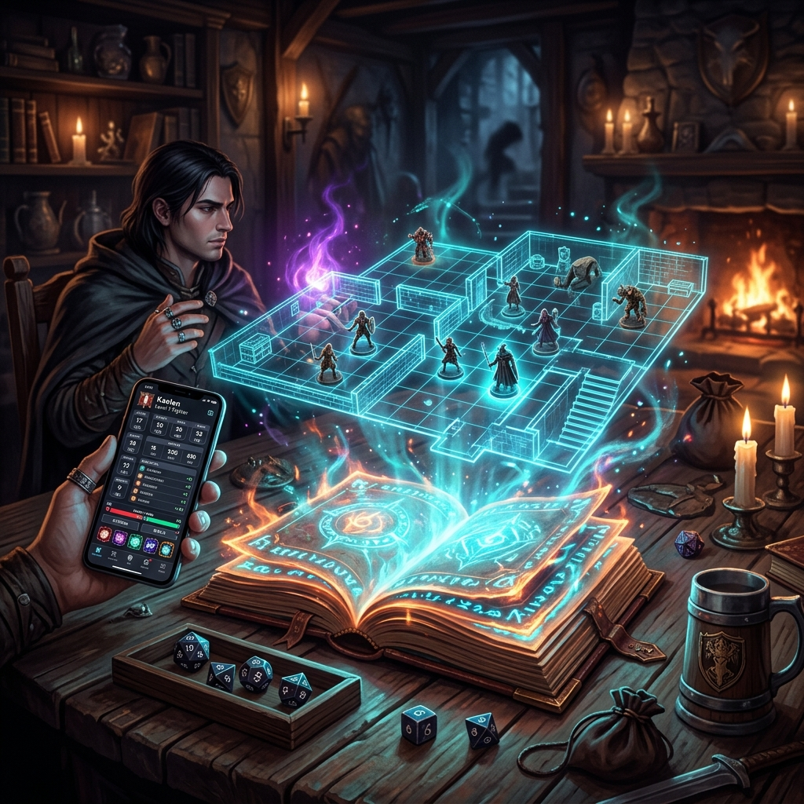

<div align="center">
  
  <h1>Grimoire TTRPG</h1>
  <p><strong>L'outil ultime pour les Maîtres du Jeu : Éditeur Markdown + VTT + IA Locale + HUB Mobile</strong></p>

  

  <p>
    <a href="#features">Fonctionnalités</a> •
    <a href="#installation">Installation</a> •
    <a href="#mobile">Mobile HUB</a> •
    <a href="#architecture">Architecture</a>
  </p>
</div>

---

## 🐉 Qu'est-ce que Grimoire ?

**Grimoire** est une application Desktop conçue par et pour les Maîtres du Jeu (TTRPG). Elle rassemble en une seule interface tout ce dont vous avez besoin pour gérer vos campagnes, de la préparation jusqu'au déroulement de la partie.

Oubliez la multiplication des onglets et des applications : Grimoire combine un gestionnaire de notes Obsidian-like, une table virtuelle (VTT) hautement performante, et l'intelligence artificielle locale pour booster votre créativité.

## ✨ Fonctionnalités Principales

### 📝 Éditeur Markdown Intelligent
- **WikiLinks (`[[Lien]]`)** : Liez vos PNJ, lieux et objets magiques avec autocomplétion intelligente.
- **Rétroliens (Backlinks)** : Ne perdez jamais le fil de vos intrigues.
- **Auto-Sauvegarde & FTS5** : Sauvegarde automatique et recherche Full-Text ultra-rapide.

### 🗺️ Virtual TableTop (VTT) "Immersive Suite"
- **💡 Éclairage Dynamique & Scintillement de Torches (PixiJS v8)** : Ambiance Jour / Crépuscule / Nuit / Ténèbres avec projection d'ombres vectorielles, torches oscillantes et éclairs d'orage synchronisés.
- **Dynamic LOS (Line of Sight)** : Les murs et portes projettent des ombres portées en temps réel, bloquant la vision des tokens.
- **🏰 Donjons & Murs Procéduraux** : Générateur de cryptes, donjons et grottes cellulaires avec tracé vectoriel automatique des murs VTT.
- **🎧 Audio Spatial 2.5D** : Musiques et ambiances spatialisées avec atténuation volumique dynamique basée sur la distance.
- **Mode Blueprint** : Tracez vos murs et configurez des portes interactives que vous pouvez ouvrir/fermer d'un clic.
- **Animations & Particules** : Tokens animés (idle, attack, hit) et particules de sang pour un feedback viscéral.
- **Brouillard de Guerre Dynamique** : Cachez les zones inexplorées — les tokens sont automatiquement masqués côté joueur selon les zones révélées/cachées en temps réel.
- **📦 Packs d'Aventures Partageables (`.grimoirepack`)** : Exportez et importez des modules complets (cartes, murs, monstres, audio, fiches) en un clic.

### 🎭 Vue Joueur Épique (Player View)
- **Ambiance & Météo** : Effets de particules (pluie, neige, brouillard) et vignettage d'état (écran rougi si PV critiques, violet si corrompu).
- **Jets de Dés 3D** : Animations 3D CSS immersives pour tous les jets de dés, avec effets "Screen Shake" sur les échecs critiques.
- **HUD de Combat** : Barre d'initiative avec portraits stylisés, et bannières pleines d'écran "AU TOUR DE..." pour fluidifier l'action.
- **Révélations Cinématiques** : Partagez des notes aux joueurs sous forme de parchemin qui se déroule, avec sceau de cire animé.

### 📱 HUB Mobile Joueur PWA (v0.4.1)
- **Mode PWA & Screen Wake Lock** : Vos joueurs gardent leur écran de smartphone toujours allumé pendant toute la session sans mise en veille.
- **🕹️ D-Pad Déplacement VTT** : Déplacez votre propre pion sur la grille de la table virtuelle directement depuis votre téléphone avec retour haptique.
- **Fiche Joueur Dark Fantasy** : Suivi des PV avec des "fioles de sang" liquides dynamiques.
- **Combat HUD** : Suivi des PV et boutons d'actions rapides (WFRP) directement sur smartphone.
- **Sketchpad Collaboratif** : Les joueurs peuvent dessiner sur leur écran pour pointer un lieu ou expliquer un plan ; le dessin apparaît sur l'écran du MJ.
- **Soundboard Joueur** : Permettez à vos joueurs de déclencher des sons d'ambiance pour ponctuer leurs actions.

### 📜 Journal de Campagne & Arbre de Quêtes
- **Gestionnaire de Quêtes** : Suivi des quêtes (Principales, Secondaires, Rumeurs, Secrets) avec étapes cochables en direct et calcul des récompenses (XP, Or).
- **📢 Diffusion du Résumé de Session** : Génère automatiquement un compte-rendu Markdown des accomplissements de la session et le diffuse en un clic sur les smartphones des joueurs.
- **🎯 Calculateur de Combat Opposé (SL Net)** : Calcul des Degrés de Succès Nets, inversion des dés pour la localisation des coups et réduction d'armure.

### 🎲 Outils MJ Avancés
Tous accessibles via le menu **🧙‍♂️ Outils MJ** de la barre d'outils VTT.
- **🤖 Assistant IA Narratif** : Générateur de descriptions immersives, d'accroches de scénarios et de dialogues de PNJ.
- **ConditionWheel** : Clic droit sur un token → roue radiale SVG pour toggler 8 conditions + bouton 🗑️ suppression directe.
- **Notes Partagées & Handouts** : Envoyez des notes et illustrations aux joueurs en temps réel.
- **Générateurs** : Rencontres, Salles, Météo (planificateur 7 jours), Marchands & Boutiques avec inventaires générés dynamiquement, Rumeurs & Potins, Carte des Relations PNJ.
- **Règles Spécifiques WFRP** : Gestion intégrée des Blessures Critiques, Mutations du Chaos, et du Calendrier Impérial.

### 🕸️ Visualisation & IA
- **Graphe de Liens** : Visualisez les connexions entre vos notes sous forme de graphe interactif.
- **L'Écrivain Fantôme (IA Locale)** : Génération de texte via Ollama (Llama, Mistral...) 100% locale et privée.

## ⌨️ Raccourcis clavier

| Raccourci | Contexte | Action |
|-----------|----------|--------|
| `Ctrl+K` | Éditeur | Palette de recherche |
| `Ctrl+J` | Éditeur | Génération IA sur la sélection |
| `Ctrl+Z` | VTT Donjon | Annuler la dernière session de peinture |
| `1`–`9`, `0` | VTT Donjon | Sélectionner une tuile de la palette |
| `E` | VTT Donjon | Mode Effacer (gomme) |
| `Alt` + Molette | VTT — token survolé | Redimensionner le token |
| Poignée ⬤ (coin du token) | VTT — mode Sélect | Redimensionner par glisser-déposer |

## 🚀 Téléchargement & Installation

### Pour les utilisateurs / Joueurs
1. Rendez-vous sur la page des [Releases GitHub](https://github.com/LordMadTrix/grimoire/releases/latest).
2. Téléchargez l'installateur `.msi` (Windows) ou `.AppImage` (Linux).
3. **Au premier lancement sous Windows** : Si l'avertissement *SmartScreen* apparaît (*« Windows a protégé votre ordinateur »*), cliquez sur **« Informations complémentaires »** puis **« Exécuter quand même »**. Ce message est normal pour les projets open-source récents en cours de développement.

### Pour les développeurs

```bash
# Installer les dépendances
npm install

# Lancer en mode développement (Tauri + Svelte)
npm run tauri dev
```

## 🛠️ Architecture

- **Frontend** : Svelte 5 (Runes) + PixiJS v8 pour le rendu haute performance.
- **Backend Desktop** : Rust (Tauri) pour les accès fichiers, SQLite FTS5 et WebSocket Mobile.
- **Mobile** : Serveur embarqué en Rust servant une web-app optimisée pour smartphones.
- **Mises à jour automatiques** : Détection et téléchargement en arrière-plan des nouvelles versions via `tauri-plugin-updater`, relié aux releases GitHub.

---
*Créé avec passion pour les rôlistes par LordMadTrix.*
